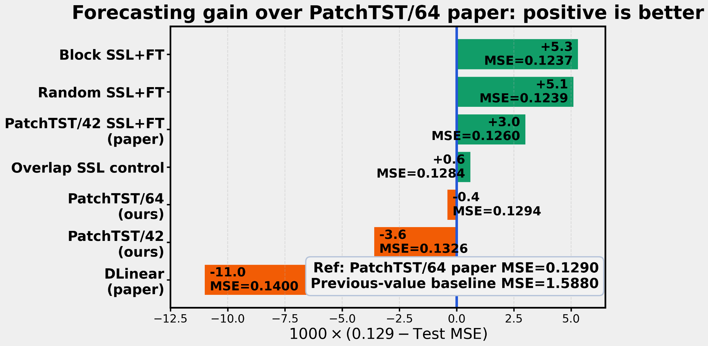

# PatchTST on Electricity: Reproduction, Masked SSL, and Scale Sensitivity

**Author:** Zhihan Liu, Cornell University  
**Course context:** Cornell CS 5782 Deep Learning final project  
**Repository:** https://github.com/KrasusZL/5782-Final-Project

## 1. Introduction

This repository contains a course-project re-implementation of **PatchTST** on the Electricity long-term forecasting benchmark. PatchTST, introduced by Nie et al. in *A Time Series Is Worth 64 Words*, represents each univariate time series as a sequence of fixed-length patch tokens and applies a shared Transformer backbone across channels.

The project has two goals: first, reproduce the supervised PatchTST/64 Electricity-96 result; second, extend the reproduction with masked-patch self-supervised learning and a temporal coarse-graining test that probes scale sensitivity beyond final test MSE.

## 2. Chosen Result

The primary reproduction target is the **PatchTST/64 Electricity result with prediction horizon 96** from Table 3 of the PatchTST paper. The paper reports test MSE **0.129** and MAE **0.222** for this setting.

This result was chosen because it is a central supervised benchmark for the paper's main claim: patching plus channel independence makes Transformer forecasting competitive on large multivariate time-series datasets. The project also uses the paper's masked self-supervised learning setting as motivation for random-mask and block-mask SSL extensions.

## 3. GitHub Contents

The repository should be organized as follows:

```text
5782-Final-Project/
├── README.md
├── LICENSE
├── requirements.txt
├── .gitignore
├── ORIGINALITY_AUDIT.md
├── code/
│   ├── PatchTST_exp.ipynb        # main experiment notebook; original workflow kept
│   ├── PatchTST.py               # supervised PatchTST implementation used by notebook
│   ├── SSL_PatchTST.py           # masked-SSL and fine-tuning modules
│   └── electricity_dataset.py    # helper required by notebook: prepare_splits/load_splits
├── data/
│   ├── README.md                 # dataset instructions
│   └── electricity.csv.gz        # optional compressed benchmark CSV; can be omitted if too large
├── results/
│   ├── README.md
│   ├── metrics_table.csv
│   ├── forecasting_gain_user.png
│   └── scale_sensitivity_user.png
├── poster/
│   └── 5782_Poster.pdf
└── report/
    ├── patchtst_electricity_report.pdf
    ├── patchtst_electricity_report.tex
    └── figures/
        ├── patchtst_paper_figure1.jpeg
        ├── forecasting_gain_user.png
        └── scale_sensitivity_user.png
```

## 4. Re-implementation Details

The main experiment is in `code/PatchTST_exp.ipynb`. The supervised model is implemented in `code/PatchTST.py`; the SSL variants are implemented in `code/SSL_PatchTST.py`; the notebook expects `prepare_splits` and `load_splits`, which are supplied by `code/electricity_dataset.py`.

The main setting is Electricity-96 with lookback window `L=512`, horizon `H=96`, patch length `P=16`, and stride `S=8` for PatchTST/64. SSL variants use masked-patch reconstruction before supervised fine-tuning. The notebook also contains experiment switches for the previous-value baseline, PatchTST/42, PatchTST/64, random SSL+FT, block SSL+FT, and an overlap-patch control.

## 5. Reproduction Steps

The notebook was originally written for a Google Drive workflow. To avoid rewriting the notebook implementation, the easiest public rerun path is to mirror the repository files into the Drive folder that the notebook already expects.

### 5.1 Environment

Python 3.10+ is recommended. A CPU can run small checks, but a CUDA GPU is strongly recommended for the full experiments.

```bash
git clone https://github.com/KrasusZL/5782-Final-Project.git
cd 5782-Final-Project
python -m venv .venv
source .venv/bin/activate      # Windows: .venv\Scripts\activate
pip install -r requirements.txt
```

### 5.2 Dataset

The notebook expects the Electricity CSV at:

```text
code/dataset/electricity.csv       # local run from code/
```

or, in the original Google Drive workflow:

```text
/content/drive/MyDrive/5782/PatchTST/dataset/electricity.csv
```

If `data/electricity.csv.gz` is included in the repository, expand it before running the notebook:

```bash
mkdir -p code/dataset
gunzip -c data/electricity.csv.gz > code/dataset/electricity.csv
```

If the compressed CSV is not included, download `electricity.csv` from the standard Autoformer/PatchTST benchmark dataset release and place it at `code/dataset/electricity.csv`.

### 5.3 Run locally without changing notebook code

Start Jupyter from the `code/` directory so the notebook can import `PatchTST.py`, `SSL_PatchTST.py`, and `electricity_dataset.py` directly:

```bash
cd code
jupyter notebook PatchTST_exp.ipynb
```

Run the notebook from top to bottom. For a fast check, set `QUICK_DEBUG = True` in the experiment-switch cell. For the full project results, keep `QUICK_DEBUG = False` and enable the intended experiment switches.

### 5.4 Run in Colab without rewriting the notebook implementation

The notebook's setup cell uses this project directory:

```python
PROJECT_DIR = Path('/content/drive/MyDrive/5782/PatchTST')
```

To run the notebook without changing its implementation, create that Drive folder and copy the repository's `code/` files into it:

```python
from google.colab import drive
drive.mount('/content/drive')

!git clone https://github.com/KrasusZL/5782-Final-Project.git /content/5782-Final-Project
!mkdir -p /content/drive/MyDrive/5782/PatchTST
!rsync -a /content/5782-Final-Project/code/ /content/drive/MyDrive/5782/PatchTST/
```

Then put the dataset where the notebook expects it:

```python
!mkdir -p /content/drive/MyDrive/5782/PatchTST/dataset
!gunzip -c /content/5782-Final-Project/data/electricity.csv.gz > /content/drive/MyDrive/5782/PatchTST/dataset/electricity.csv
```

Open or copy `PatchTST_exp.ipynb` from `/content/drive/MyDrive/5782/PatchTST/` and run it. If the compressed CSV is not committed to GitHub, manually upload or download `electricity.csv` into the same `dataset/` folder.

### 5.5 Expected outputs

The notebook writes intermediate artifacts to:

```text
experiment_artifacts/
├── models/
├── plots/
└── results/
```

These generated artifacts are ignored by Git because checkpoints and logs are machine-specific. The selected final figures and summary metrics are stored in `results/`.

## 6. Results / Insights



| Method | Test MSE | Interpretation |
|---|---:|---|
| Previous-value baseline | 1.5880 | trivial baseline, much worse |
| DLinear paper baseline | 0.1400 | paper baseline |
| PatchTST/42 supervised | 0.1326 | shorter-lookback control |
| PatchTST/64 paper baseline | 0.1290 | reproduction target |
| PatchTST/64 supervised reproduction | 0.1294 | close to paper result |
| Overlap SSL control | 0.1284 | small improvement |
| PatchTST/42 SSL+FT paper reference | 0.1260 | paper SSL context |
| Random SSL+FT | 0.1239 | improves over supervised reproduction |
| Block SSL+FT | **0.1237** | best MSE in these runs |

The supervised PatchTST/64 reproduction nearly matches the reported Electricity-96 result. The masked-patch SSL variants improve the fine-tuned forecasting result in these runs, with block masking slightly outperforming independent random masking. The temporal coarse-graining probe suggests that the learned representation is scale-structured rather than scale-invariant.

## 7. Conclusion

This project reproduces the core PatchTST/64 Electricity-96 result within a small margin and extends the experiment with masked-patch SSL and scale-sensitivity analysis. The main implementation lesson is that patch count, padding convention, instance normalization, and dataset path handling must be controlled carefully for the reproduction to be interpretable.

## 8. References

- Yuqi Nie, Nam H. Nguyen, Phanwadee Sinthong, and Jayant Kalagnanam. 2023. *A Time Series Is Worth 64 Words: Long-term Forecasting with Transformers*. ICLR 2023. https://arxiv.org/abs/2211.14730
- Official PatchTST implementation by the paper authors: https://github.com/yuqinie98/PatchTST
- Artur Trindade. 2015. *ElectricityLoadDiagrams20112014*. UCI Machine Learning Repository. https://doi.org/10.24432/C58C86
- PyTorch documentation and implementation tools used for the re-implementation.

## 9. Acknowledgements

This work was completed as a Cornell CS 5782 Deep Learning final project. The project builds on the PatchTST paper and uses the Electricity benchmark from the UCI Machine Learning Repository.

## License and Attribution Note

The re-implementation code is released under the MIT License; see `LICENSE`. The PatchTST architecture, paper figure, and original method belong to the PatchTST authors and are cited in the report. The dataset should be cited through the UCI Machine Learning Repository.
